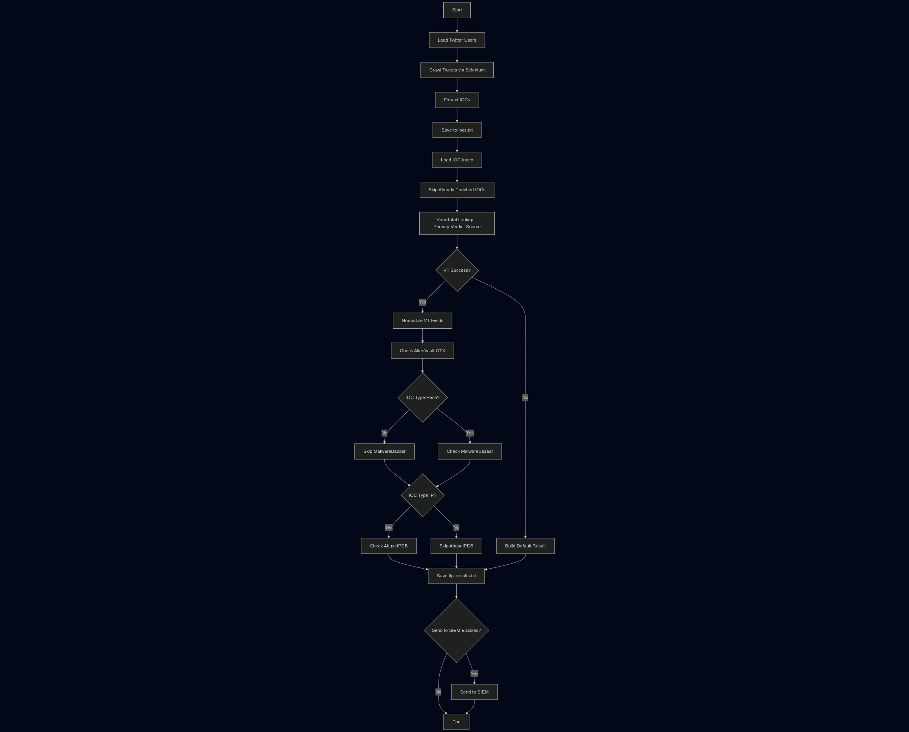

# Turning Chaos into Intel: Building an Automated Threat Intelligence Pipeline from Twitter (X)

*How a cup of cold coffee and repetitive copy-pasting inspired a lightweight, automated CTI pipeline that turns raw tweets into enriched, SIEM-ready security intelligence.*

---


*Photo by [Markus Spiske](https://unsplash.com/@markusspiske) on Unsplash*

---

## The 8:00 AM Threat Hunter Routine

If you work in Cyber Threat Intelligence (CTI) or SOC operations, this morning routine probably sounds painfully familiar:

1. Grab your morning coffee.
2. Open Twitter (X).
3. Check the timelines of seasoned malware researchers and threat groups (@malwrhunterteam, @abuse_ch, and the infosec community).
4. Spot a fresh drop: a brand new ransomware campaign with juicy IOCs.
5. Manually copy a defanged URL like `hxxps://satinmaple4[.]com/curl/0djk1usgn/yrdkr6r6fyp8viva.txt`.
6. Open four different browser tabs: **VirusTotal**, **AlienVault OTX**, **AbuseIPDB**, and **MalwareBazaar**.
7. Clean up the defanged brackets, query each platform, evaluate scores, and paste the results into a spreadsheet or ticketing system.

By the time you finish investigating three tweets, your coffee is stone cold, and an hour of your morning has evaporated into manual grunt work.

> *"In threat intelligence, speed is defense. A malicious domain active right now is exponentially more valuable than a threat report published two weeks after the incident."*

The threat hunting community on X is fast, sharp, and constantly sharing live campaign data before formal advisories even exist. But raw tweets are messy, informal, and unstructured.

I wanted to bridge that gap. So, I built a lightweight, end-to-end Python pipeline to automate the entire lifecycle—from scrolling timelines to querying multi-engine threat intelligence platforms and forwarding actionable records straight to a SIEM.

Here is the story of how it works, the architectural design, and the unexpected engineering hurdles along the way.

---

## The Vision & Architecture

The goal was simple: **Zero manual clicking.**

I wanted a modular system where I could drop a list of Twitter handles into a text file, run a single command, and sit back while the system crawled, parsed, normalized, verified reputation across multiple providers, and delivered a clean dataset.

Here is the high-level architecture of how the pipeline flows:



The workflow breaks down into two core stages:

```
[ Twitter Timelines ]
         │
         ▼
┌──────────────────┐
│  STAGE 1: CRAWL  │ ──► Extracts & Defangs IOCs (SHA256, IPv4, URLs)
└──────────────────┘
         │
         ▼
┌──────────────────┐
│  STAGE 2: ENRICH │ ──► Queries VT, AlienVault, AbuseIPDB, MalwareBazaar
└──────────────────┘
         │
         ├──► [ tip_results.txt ]
         └──► [ Optional SIEM Ingestion ]
```

---

## Stage 1: Infiltrating the Feed (Stealth & Extraction)

### Why Crawling Twitter Isn't Trivial Anymore
In the past, consuming Twitter data was as simple as hitting an open API endpoint. Today, public endpoints are heavily restricted, and automated scraping encounters aggressive anti-bot protection (Cloudflare challenges, device fingerprinting, and login walls).

To overcome this reliably without fragile workarounds, the crawler uses **Selenium Chrome in headless mode** paired with authenticated session cookies (`auth_token` and `ct0`).

```python
# Launching with realistic desktop fingerprinting
opts = Options()
opts.add_argument("--headless=new")
opts.add_argument("--window-size=1920,1080")
opts.add_argument("--user-agent=Mozilla/5.0 (X11; Linux x86_64) AppleWebKit/537.36...")
opts.add_argument("--disable-blink-features=AutomationControlled")
opts.add_experimental_option("excludeSwitches", ["enable-automation"])
```

Injecting session cookies right after initializing the driver allows the bot to seamlessly load researcher profiles just like a legitimate authenticated browser session.

---

### The Art of Defanging & Regex Extraction
Threat researchers intentionally "defang" malicious links so readers don't accidentally click them. You'll often see:
* `hxxps://` or `hxxp://` instead of `https://`
* `103.193.173[.]83` or `46.151.178(.)13`
* `http[:]//`

Before running pattern matching, the crawler runs an aggressive normalization pass:

```python
def normalize(text: str) -> str:
    # Convert defanged protocol
    text = re.sub(r'hxxp(s?)://', r'http\1://', text, flags=re.IGNORECASE)
    # Neutralize bracket and parenthesis defanging
    text = text.replace("[.]", ".").replace("(.)", ".").replace("[:]", ":")
    return text
```

From there, precise regular expressions detect:
- **SHA256 Hashes:** 64-character hexadecimal digests.
- **IPv4 Addresses:** Valid 4-octet IP boundaries.
- **HTTP / HTTPS URLs:** Full paths and domain parameters.

Every new finding is stored in `iocs.txt` alongside the original tweet source link for provenance.

---

## Stage 2: The Multi-Engine Enrichment Hub

Collecting raw IOCs is only half the battle. A standalone IP address like `94.154.43.48` tells you very little on its own. Is it a known Cobalt Strike server? A compromised scanner? Or a false positive?

The enrichment engine takes each queued IOC and queries four specialized intelligence platforms:

| Platform | Targeted IOC Types | What We Extract |
| :--- | :--- | :--- |
| **VirusTotal** | Hash, IP, URL | Malicious detection count & last scan timestamp |
| **AlienVault OTX** | Hash, IP, URL | Threat pulse counts & community indicator links |
| **MalwareBazaar** | Hash (SHA256) | Malware family signatures (e.g., *AdaptixC2*, *AgentTesla*) & vendor intel count |
| **AbuseIPDB** | IPv4 | Abuse confidence score (0-100%), total reports & domain info |

### Respecting the Limits
Threat intel APIs aren't infinite. Public tiers (especially VirusTotal) enforce rate limits (e.g., 4 requests per minute). The engine enforces a graceful delay between lookups and automatically skips previously enriched IOCs:

```python
pending_iocs = [item for item in indexed_iocs if item[0] not in seen_results]
```

If an IOC is already in our database, it's skipped immediately. Zero wasted API credits.

---

## Real-World Output: What Does the Intel Look Like?

When you run the pipeline:

```bash
python3 main.py --tweets 5 --siem
```

The system produces a unified, clean execution log:

```text
2026-09-05 17:28:10 | INFO    | =================================================================
2026-09-05 17:28:10 | INFO    | [*] STAGE 1: TWITTER IOC CRAWLER STARTED
2026-09-05 17:28:10 | INFO    | =================================================================
2026-09-05 17:28:10 | INFO    | [+] Target accounts loaded: 2 ['malwrhunterteam', 'abuse_ch']
2026-09-05 17:28:10 | INFO    | [1/2] Crawling timeline of @malwrhunterteam
2026-09-05 17:28:23 | INFO    |   [+] New IOC collected: [HASH] d8b6088156477df342a5387bc81aef1e...
2026-09-05 17:28:44 | INFO    | =================================================================
2026-09-05 17:28:44 | INFO    | [*] STAGE 2: THREAT INTELLIGENCE PLATFORM (TIP) ENRICHMENT STARTED
2026-09-05 17:28:44 | INFO    | =================================================================
2026-09-05 17:28:44 | INFO    | [1/1] Enriching [HASH] d8b6088156477df342a5387bc81aef1e...
2026-09-05 17:28:44 | INFO    |   ├─ VirusTotal    : Malicious Score = 52 | Last Analysis = 2026-08-27
2026-09-05 17:28:46 | INFO    |   ├─ AlienVault OTX: Pulses = 1
2026-09-05 17:28:47 | INFO    |   ├─ MalwareBazaar : Signature = AdaptixC2 | Intel Count = 13
2026-09-05 17:28:47 | INFO    |   └─ Status        : Saved to tip_results.txt
```

And in `tip_results.txt`, you get a structured record:

```text
twitter_link | https://x.com/malwrhunterteam/status/2082080091786313891
ioc          | d8b6088156477df342a5387bc81aef1e242f12d2f722e5e2030cbc51c203d547
ioc_type     | hash
vt_score     | 52 / 70 engines
signature    | AdaptixC2
vendor_intel | 13 security vendors confirmed
```

From a single tweet, we now have high-fidelity attribution, confirmed malicious verdicts, and direct links ready for automated firewall blocking or SIEM alerting.

---

## Lessons Learned & Engineering Gotchas

Building automation around social media and external APIs always comes with unexpected hurdles. Here are three major takeaways:

### 1. The Headless Anti-Bot Trap
When testing Selenium headless Chrome, Twitter initially threw `HTTP 403 Forbidden`, navigating to `chrome-error://chromewebdata/`. Because the browser landed on an error page, attempting to inject cookies triggered `InvalidCookieDomainException`. 

*Lesson:* Modern bot detection looks for automation signatures like `navigator.webdriver = true` and default headless user-agents. Disabling Blink automation features and explicitly declaring standard window dimensions (`1920x1080`) resolved the issue instantly.

### 2. Schemas Need Relentless Discipline
During development, AlienVault fields were returning `alienvault_checked_at` and `alienvault_pulse_count`, while the database handler expected `alienvault_time` and `alienvault_pulse_info_count`. It failed silently—saving empty columns without raising exceptions.

*Lesson:* Always enforce strict key mapping validations across provider layers so mismatched schemas never escape unnoticed.

### 3. Clear Logs Are as Important as Working Code
A script that dumps raw API outputs into a log file creates cognitive overload. Converting raw provider strings into an ASCII tree structure (`├─`, `└─`) with stage counters (`[1/10]`) turned messy logs into an intuitive operational dashboard.

---

## Conclusion & What's Next

Threat intelligence doesn't always need seven-figure enterprise platforms to be effective. By combining simple automation tools with the power of the open security community, you can build a responsive, automated pipeline that saves hours of manual analysis every week.

### What's Next on the Roadmap:
- [ ] Direct Telegram / Discord webhook alerts for high-severity hits (VT score > 30).
- [ ] Automated YARA rule fetching from MalwareBazaar payloads.
- [ ] Integration with MISP (Malware Information Sharing Platform).

If you're interested in exploring or extending the project, feel free to dive into the codebase, test it with your favorite threat intel accounts, and make it your own!

---

*Happy Hunting! 🛡️*
